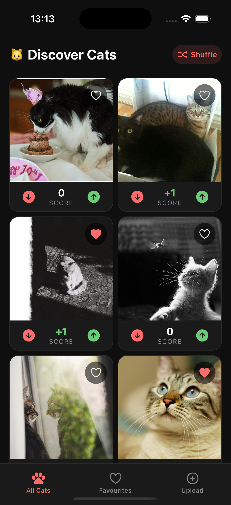
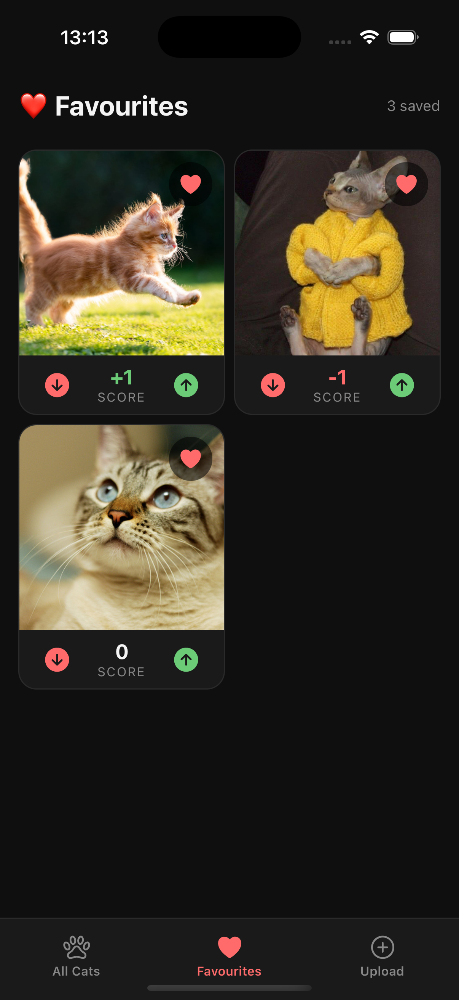
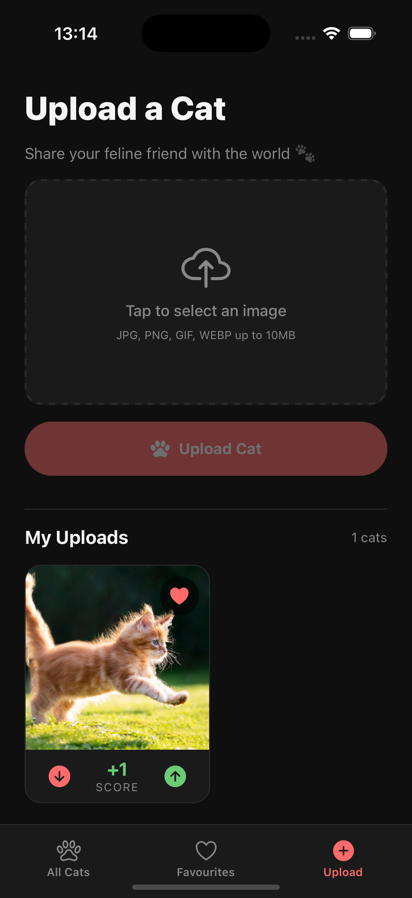
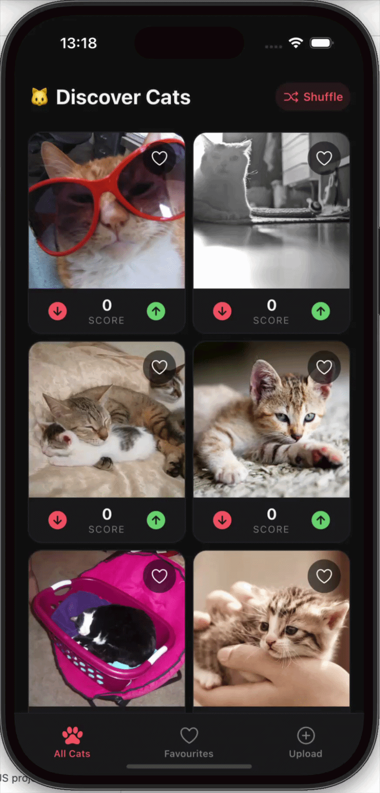

# 🐱 CatApp

A React Native mobile app that lets you discover, upload, vote, and favourite cat images using [The Cat API](https://thecatapi.com).

---

## Features

- **Discover** — Browse random cat images from The Cat API
- **Upload** — Upload your own cat photos with validation and error handling
- **Favourite** — Save cats to your favourites with a heart toggle
- **Vote** — Upvote and downvote cats, with a live score per cat
- **My Uploads** — View only the cats you've uploaded

---

## Tech Stack

| Concern | Library |
|---|---|
| Framework | React Native + Expo (managed workflow) |
| Language | TypeScript |
| Navigation | React Navigation v6 (Bottom Tabs) |
| Server state | TanStack React Query v5 |
| Client state | Zustand |
| HTTP | Axios |
| Image picker | expo-image-picker |
| Device ID | expo-application |
| Haptics | expo-haptics |
| Toast | react-native-toast-message |

---

## 📱 Screenshots

<p align="center">
  
  
  
  
</p>


## Getting Started

### Prerequisites

- Node.js 18+
- Expo CLI (`npm install -g expo-cli`)
- iOS Simulator (Xcode) or Android Emulator, or the Expo Go app

### 1. Clone the repo

```bash
  git clone https://github.com/sbalcin/CatApp.git
```

### 2. Install dependencies

```bash
  npm install
```

### 3. Start the app

```bash
  npx expo start
```

## Environment Variables

| Variable | Description |
|---|---|
| `EXPO_PUBLIC_CAT_API_KEY` | Cat API key |

Copy to `.env` and fill in your key.

---


## Notes

- Images must contain a visible cat — The Cat API runs an AI classifier on every upload and will reject non-cat images with a `400` error
- Votes and favourites are scoped per device using a stable device ID (`expo-application`)
- Optimistic updates are used for votes and favourites so the UI responds instantly without waiting for the API
